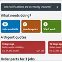
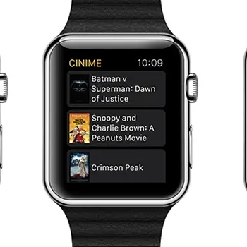
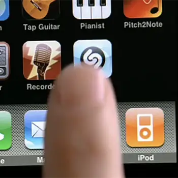
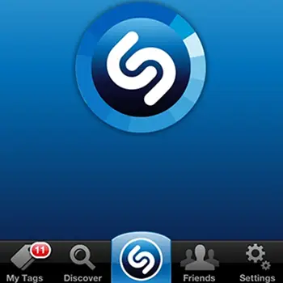
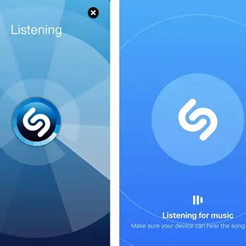
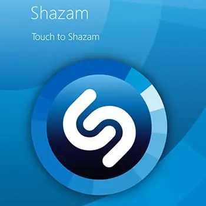
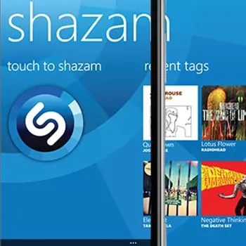

# {{page.title}}

I've been fortunate enough to design one of the top apps of all time, Shazam; as well as designing a white label app for low cost airlines, apps for traders and cinema goers

   

   		
   	

   

   		
   	

   

  	 
  	

   

   		
	

	

		
	

	

		
	

	

		
	

		

		
	

	

		
	

	

		
	

