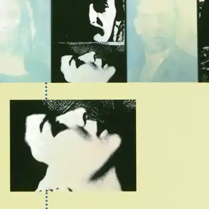
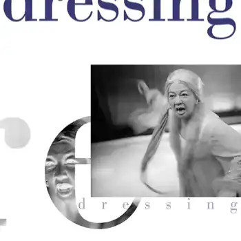

# {{page.title}}

Design of many hundreds of book covers while working for Routledge, Cassell, Pluto Press, and many others in a freelance capacity. Here is a selection.

   

   		
   	

   

  	 
  	

   

   		
	

	

		
	

	

		
	

	

		
	

	

		
	

		

		
	

	

		
	

	

		
	

	

		
	

	

		
	

		

		
	

	

		
	

		

		
	

	

		
	

		

		
	

	

		
	
	

