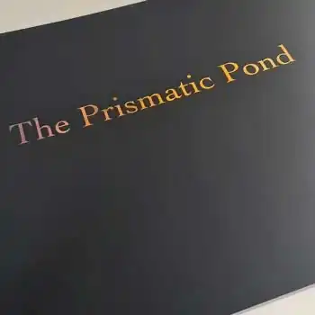

# {{page.header}}

Method Design provides design for apps, specialising in UX and UI for iOS, Android and web; print, including book design; digital photography, and digital imaging and photo restoration.

If you're interested in using any of our services, please contact us below.

## Spotlight

   

   		
   	

   

   		
   	

   

  	 
  	

   

   		
	

